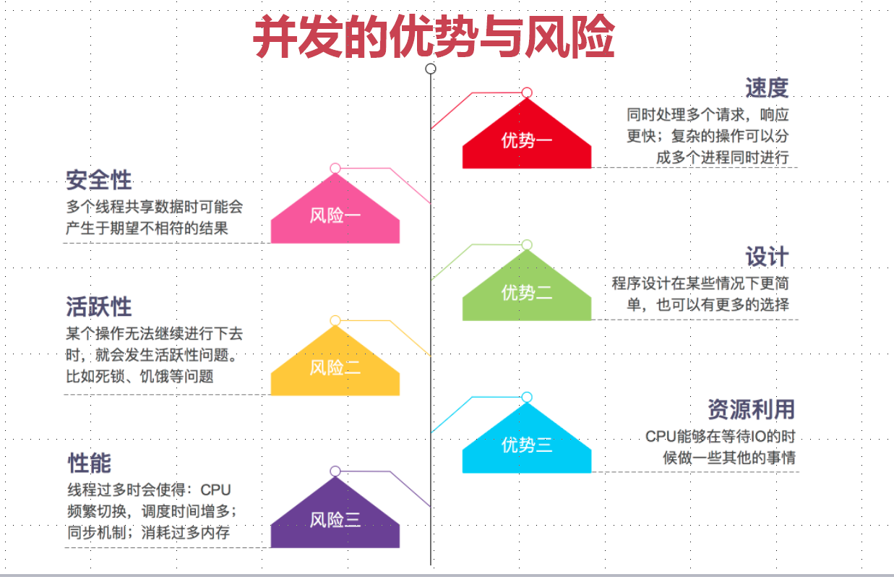

## java并发编程与高并发解决方案
### 并发基本概念
    - 同时拥有两个或者多个线程, 如果程序在单核处理器上运行, 多个线程将交替地换人或者换出内存, 这些线程是同时"存在"的, 每个线程都处于执行过程中的某个状态, 如果运行在多核处理器上, 此时, 程序中的每个线程都将分配到一个处理器核上, 因此可以同时运行。
### 高并发
    - 高并发(High Concurrency)是互联网分布式系统架构设计中必须考虑的因素之一, 它通常是指, 通过设计保证系统能够同时并行处理很多请求。
#### 并发: 多个线程操作相同的资源, 保证线程安全, 合理使用资源
#### 高并发: 服务能同时处理很多请求, 提高程序性能 
### CPU多级缓存

#### 为什么CPU需要cache
     - CPU的频率太快了, 快到主存跟不上, 这样在处理器时钟周期内, CPU常常需要等待主存, 浪费资源。所以cache的出现是为了缓解CPU和内存之间速度不匹配问题(结构:cpu -> cache -> memory)
#### CPU cache有什么意义
     - 时间局部性: 如果某个数据被访问, 那么在不久的将来它很可能被再次访问
     - 空间局部性: 如果某个数据被访问, 那么与它相邻的数据很快也可能被访问
#### 缓存一致性(MESI)
     - 用于保证多个CPU cache之间缓存共享数据的一致
       - M:Modified 被修改
       - E:Eclusive 独享
       - S:Shared 共享
       - I:Invalid 无效的
#### 乱序执行优化
     - 处理器为提高运算速度而做出违背原有顺序的优化
### java内存模型(Java Memory Model, JMM)
    - java内存模型是一种规范, 它规定了java虚拟机和计算机是如何协同工作的, 它规定了一个线程如何和何时可以看到由其他线程修改过后的变量的值以及在必须时如何同步地访问共享变量。

#### java内存模型抽象结构图

#### 同步八种操作
     - lock

### 并发的优势与风险

### 线程安全性
    - 定义: 当多个线程访问某个类时, 不管运行时环境采用何种调度方式或者这些进程将如何交替执行, 并且在主调代码中不需要任何额外的同步或协同, 这个类都能表现出正确的行为, 那么就称这个类是线程安全的。
    - 原子性:提供了互斥访问, 同一时刻只能有一个线程来对它进行操作
    - 可见性:一个线程对主内存的修改可以及时的被其他线程观察
    - 有序性:一个线程观察其他线程中的指令执行顺序, 由于指令重排序的存在, 该观察结果一般杂乱无序执行顺序, 由于指令重排序的存在, 该观察结果一般杂乱无序。
### 原子性
#### 原子性 - Atomic
    - AtomicXXX: CAS、Unsafe.compareAndSwapInt
    - AtomicLong、LongAdder
    - AtomicReference、AtomicReferenceFieldUpdater
    - AtomicStampReference:CAS的ABA问题
    CAS compareAndSwap

#### 原子性 - 锁
     - synchronized:依赖JVM
     - Lock:依赖特殊的CPU指令, 代码实现, ReentrantLock
##### synchronized 修饰对象
      - 修饰代码块: 大括号括起来的代码, 作用域调用的对象
      - 修饰方法: 整个方法, 作用于调用的对象
      - 修饰静态方法:整个静态方法, 作用于所有对象
      - 修饰类:括号括起来的部分, 作用于所有对象
##### synchronized 与 Lock对比
      - synchronized: 不可中断锁, 适合竞争不激烈, 可读性好
      - Lock: 可中断锁, 多样化同步, 竞争激烈时能维持常态
      - Atomic: 竞争激烈时能维持常态, 比Lock性能好; 只能同步一个值
### 可见性
- 导致共享变量在线程间不可见的原因
  - 线程交叉执行
  - 重排序结合线程交叉执行
  - 共享变量更新后的值没有在工作内存与主存间及时更新
#### 可见性 - synchronized
- JMM关于synchronized的两条规定
  - 线程解锁前, 必须把共享变量的最新值刷新到主内存
  - 线程加锁时, 将清空工作内存中共享变量的值, 从而使用共享变量时需要从主内存中重新读取最新的值(注意, 加锁和解锁是同一把锁)
#### 可见性 - volatile
- 通过加入内存屏障和禁止重排序优化来实现
  - 对volatile变量写操作时, 会在写操作后加入一条store屏障指令, 将本地内存中的共享变量值刷新到主内存
  - 对volatile变量读操作时, 会在读操作前加入一条load屏障指令, 从主内存中读取共享变量

### 有序性
- java内存模型中, 允许编译器和处理器对指令进行重排序, 但是重排序过程不会影响到单线程程序的执行, 却会影响到多线程并发执行的正确性
- vlatile、synchronized、Lock
#### 有序性 - happends-before原则
- 程序次序规则:一个线程内, 按照代码顺序, 书写在前面的操作先行发生于写在后面的操作
- 锁定规则:一个unLock操作先行发生于后面对同一个锁的lock操作
- volatile变量规则:对一个变量的写规则先行发生于后面对这个变量的读操作
- 传递规则:如果操作A先行发生于操作B, 而操作B又先行发生于操作C, 则可以得出操作A先行发生于操作C
- 线程启动规则:Thread对象的start()方法先行发生于此线程的每一个动作
- 线程中断规则:对线程interrupt()方法的调用先行发生于被中断线程的代码检测到中断事件的发生
- 线程终结规则: 线程中所有的操作都先行发生于线程的终止检测, 我们可以通过Thread.join方法结束、Thread.isAlive()返回值手段检测到线程已经终止执行
- 对象终结规则:一个对象的初始化完成先行发生于他的finalize()方法的开始

### 发布对象
- 发布对象:使一个对象能够被当前范围之外的代码所使用
- 对象逸出:一种错误的发布。当一个对象还没有构造完成时, 就使它被其他线程所见

### 安全发布对象
- 在静态初始化函数中初始化一个对象的引用
- 将对象的引用保存到volatile类型域或者AtomicReference对象中
- 将对象的引用保存到某个正确够早对象的final类型域中
- 将对象的引用保存到一个由锁保护的域中

### 不可变对象
- 不可变对象需要满足的条件
  - 对象创建以后其状态就不能修改
  - 对象所有域都是final类型
  - 对象是正确创建的(在对象创建期间, this引用没有逸出)
### final关键字
- final关键字:类、方法、变量
  - 修饰类:不能被继承
  - 修饰方法:1.锁定方法不被继承类修改2.效率
  - 修饰变量:基本数据类型变量、引用类型变量
### 其他不可变
- Collections.ummodifiableXXX:Collection、List、Set、Map...
- Guava:ImmutableXXX:Collection、List、Set、Map...

### 线程封闭
- Ad-hoc 线程封闭:程序控制实现, 最糟糕, 忽略
- 堆栈封闭: 局部变量, 无并发问题
- ThreadLocal 线程封闭:特别好的封闭方法

### 线程不安全类与写法
- StringBuilder不安全 -> StringBuffer安全
- SimpleDateFormate不安全 -> JodaTime
- ArrayList, HashSet, HashMap等Collections
- 先检查再执行:if(condition(a)){handle(a)}

### 同步容器
- 不安全 -> 安全
- ArrayList -> Vector,Stack
- HashMap -> HashTable(key、value不能为null)
- Collections.synchronizedXXX(List、 Set、 Map)

### 并发容器J.U.C java.util.concurrent
#### 分为 tool、locks、atomic、collections、executors
- ArrayList -> CopyOnWriteArrayList
- HashSet、TreeSet -> CopyOnWriteArraySet 、ConcurrentSkipListSet
- HashMap、TreeMap -> ConcurrentHashMap ConcurrentHashMap、 ConcurrentSkipListMap

### 安全共享对象策略总结
- 线程限制:一个呗线程限制的对象, 由线程独占, 并且只能被占有它的线程修改
- 共享只读:一个共享只读的对象, 在没有额外同步的情况下, 可以被多个线程并发访问, 但是任何线程都不能修改它。
- 线程安全对象:一个线程安全的对象或者容器, 在内部通过同步机制来保证线程安全, 所以其他线程无需额外的同步就可以通过公共接口随意访问它。
- 被守护对象:被守护对象只能通过获取特定的锁来访问。

### AbstractQueuedSynchronizer - AQS 同步器

- 使用Node(双向链表)实现FIFO队列, 可用于构建锁或者其他同步装置的基础框架
- 利用了一个int类型表示状态
- 使用方法继承
- 自类通过继承并通过实现它的方法管理其状态{acquire和release}的方法操纵状态
- 可以同时实现排它锁和共享锁模式(独占、共享)

#### AQS同步组件
- CountDownLatch
- Semaphore
- CyclicBarrier
- ReentrantLock
- Condition
- FutureTask

##### 乐观锁和悲观锁
- 悲观锁:总是假设最坏的情况, 每次去拿数据的时候都认为别人会修改, 所以每次在拿数据的时候都会上锁, 这样别人想拿这个数据就会阻塞直到它拿到锁。传统的关系型数据库里边就用到了很多这种锁机制, 比如行锁, 表锁, 读锁, 写锁等, 都是在做操作之前先上锁。再比如Java里面的同步原语synchronized关键字的实现也是悲观锁。
- 乐观锁:顾名思义, 就是很乐观, 每次去拿数据的时候都认为别人不会修改, 所以不会上锁, 但是在更新的时候会判断一下在此期间别人有没有去更新这个数据, 所以不会上锁, 但是在更新的时候会判断一下在此期间别人有没有去更新这个数据, 可以使用版本号等机制。乐观锁适用于多读的应用类型, 这样可以提高吞吐量, 向数据库提供的类似于write_condition机制, 其实都是有提供的乐观锁。在Java中java.util.concurrent.atomic包下面的原子变量类就是使用了乐观锁的一种实现方式CAS实现的。
##### ReentrantLock(可重入锁)和synchronized区别
- 可重入性
- 锁的实现 前者jdk 后者jvm
- 性能的区别
- 功能区别
###### ReentrantLock独有的功能
- 可指定是公平锁还是非公平锁
- 提供了一个Condition类, 可以分组唤醒需要唤醒的线程
- 提供能够终端等待锁的线程机制, lock.lockInterruptibly

少量竞争者 synchronized
竞争者不少增长能预估 ReentrantLock

#### FuntureTask
- Callable与Runnable接口对比
- Funture接口
- FuntureTask类

#### BlockingQueue
- ArrayBlockingQueue
- DelayQueue
- LinkedBlockingQueue
- PriorityBlockingQueue
- SynchronousQueue

### 线程池
- new Thread弊端
  - 每次new Thread 新建对象, 性能差
  - 线程缺乏统一管理, 可能无限制的新建线程, 相互竞争, 有可能占用过多系统资源导致死机或OOM
  - 缺少更多功能, 如更多执行、定期执行、线程中断
- 线程池的好处
  - 重用存在的线程, 减少对象创建、消亡的开销, 性能佳
  - 可有效控制最大并发线程数, 提高系统系统资源利用率, 同时可以避免过多资源竞争, 避免阻塞
  - 提供定时执行、定期执行、单线程、并发数控制等功能

#### ThreadPoolExecutor
- corePoolSize:核心线程数量
- maximumPoolSize:线程最大线程数
- workQueue:阻塞队列, 存储等待执行的任务, 很重要, 会对线程池运行过程产生重大影响
- keepAliveTime:线程没有任务执行时最多保持多久时间终止
- unit:keepAliveTime时间单位
- threadFactory:线程工厂, 用来创建线程
- rejectHandle:当拒绝处理任务时的策略
#### 方法
- execute():提交任务, 交给线程池执行
- submit():提交任务, 能够返回执行结果execute+Future
- shutdown:关闭线程池, 等待任务都执行完
- shutdownNow():关闭线程池, 不等待任务执行完
- getTaskCount():线程池已执行和未执行的任务总数
- getCompletedTaskCount():已完成的任务数量
- getPooSize():线程池当前的线程数量
- getActiveCount():当前线程池中正在执行任务的线程数量

#### Executor框架接口
- Executors.newCachedThreadPool 可缓存
- Executors.newFixedThreadPool 
- Executors.newScheduledThreadPool
- Executors.newSinglePool

#### 线程池的合理配置
- CPU密集型任务, 就需要尽量压榨CPU, 参考值可以设为NCPU+1
- IO密集型任务, 参考值可以设置为2*NCPU

#### 什么是死锁? 死锁产生的条件?
##### 概述
    在两个或者多个并发进程中, 如果每个进程持有某种资源而又等待其它进程释放它或者它们现在保持着的资源, 在未改变这种状态之前都不能向前推进, 称这一组进程产生了死锁。通俗的讲就是两个或多个进程无限期的阻塞、相互等待的一种状态。
##### 死锁产生的四个条件(有一个条件不成立, 则不会产生死锁)      
    - 互斥条件:一个资源一次只能被一个进程使用
    - 请求与保持条件:一个进程因请求资源而阻塞时, 对已获得资源保持不放。
    - 不剥夺条件:进程获得的资源, 在未完全使用完之前, 不能强行剥夺。
    - 循环等待条件:若干进程之间形成一种头尾相接的环形等待资源关系。

#### 多线程并发最佳实践
- 使用本地变量
- 使用不可变类
- 最小化锁的作用域范围:S=1/(1-a+a/n)
- 使用线程池的Executor, 而不直接new Thread执行
- 宁可使用同步也不要使用wait和notify
- 使用BlockingQueue实现生产-消费模式
- 使用并发集合而不是使用加了锁的同步集合
- 使用Semaphore创建有界的访问
- 宁可使用同步代码块, 也不使用同步的方法
- 避免使用静态变量

#### Spring与线程安全
- Spring bean:singleton、prototype
- 无状态对象

#### HashMap与ConcurrentHashMap