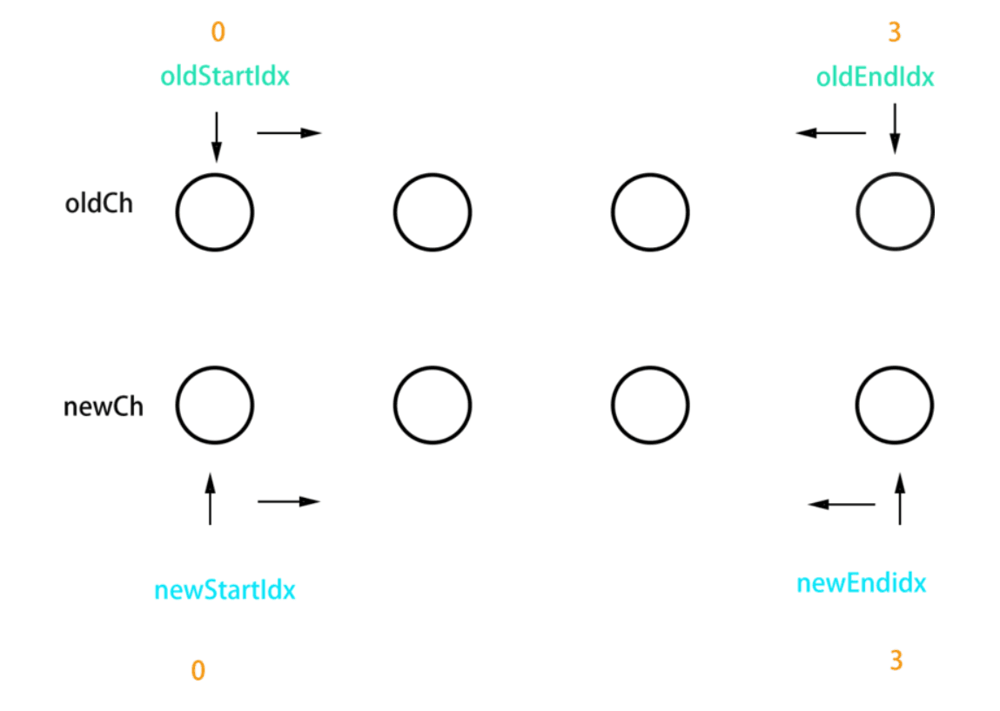

## Vue.js
### 如何理解MVVM
    - MVC 
    - MVVM
      - view通过dom事件绑定操作model
      - model通过data绑定操作view
    - MVVM框架的三大要素
      - 响应式
      - 模板引擎
      - 渲染
### 如何实现MVVM
### Vue源码
### 使用jquery和使用框架的区别
    - jquery实现todo-list
    - vue实现todo-list
    - jQuery和vue的区别
      - 数据和视图的分离,解耦(开放封闭原则)
      - 以数据驱动视图,只关心数据变化,DOM操作被封装
### vue如何使用响应式
    - 响应式
      - 修改data属性之后,vue立刻监听到
      - data属性被代理到vm上
### vue如何解析模板
    - 模板
      - 本质:字符串
      - 有逻辑,如v-if,v-for等
      - 与html格式很像,但是有很大区别
      - 最终还要转换为html显示
    - render函数
      - with的用法
    - render函数与vdom
### vue的整个实现流程
    - 第一步:解析模板成render函数 
      - with的用法
      - 模板中的所有信息都被render函数包含
      - 模板中用到的data中的属性,都变成了JS变量
      - 模板中的v-model v-for v-on都变成了JS逻辑
      - render函数返回vnode
    - 第二步:响应式开始监听
      - Object.defineProperty
      - 将data中的属性代理到vm上
    - 第三步:首次渲染,显示页面,且绑定依赖
      - 初次渲染,执行updateComponent,执行vm_render函数
      - 执行render函数,会访问到vm.list和vm.title
      - 会被响应式的get方法监听到
      - 执行updateComponent,会走到vdom的patch方法
      - patch将vnode渲染成DOM,初次渲染完成
    - 第四步:data属性变化,触发rerender
      - 修改属性,被响应式set监听到
      - set中执行updateComponent
      - updateComponent重新执行vm._render()
      - 生成vnode和prevnode对比,重新渲染
### 为何要监听get,直接监听set不行吗?
    - data中有很多属性,有些被用到,有些可能不被用到
    - 被用到的会走get,不被用到的不会走get
    - 未走到get中的属性,set的时候我们也无需关心
    - 避免不必要的重复渲染

### Vue的diff算法
** diff的实现主要通过两个方法, patchVnode和updateChildren **
** patchVnode有两个参数, 分别老节点oldVnode, 新节点vnode。 主要分五种情况**
   - if(oldVnode === vnode), 他们的引用一致, 可以认为没有变化
   - if(oldVnode.text !== null && vnode.text !== null && oldVnode.text !== vnode.text), 文本节点的比较, 需要修改, 则会调用Node.textContent = vnode.text
   - if(oldCh && ch && oldCh !== ch), 两个节点都有子节点, 而且它们不一样, 这样我们会调用updateChildren函数比较子节点, 这是diff的核心。
   - if(ch), 只有新节点有子节点, 调用createEle(vnode), vnode.el已经引用了老的dom节点, createEle函数会在老dom节点上添加子节点。
   - if(oldCh), 新节点没有子节点, 老节点有子节点, 直接删除老节点。
** updateChildren是关键, 这个过程可以概括如下 **

oldCh 和 newCh各有两个头尾的变量StartIdx和EndIdx, 它们的2个变量相互比较, 一共有四种比较方式。如果4种比较都没匹配, 如果设置了key, 就会用key进行比较, 在比较的过程中, 变量会往中间靠, 一旦StartIdx > EndIdx表明oldCh和newCh至少有一个已经遍历完了, 就会结束比较。