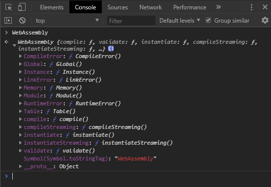

## WebAssembly

### javascript在浏览器中是怎么跑起来的
- 对于现在的计算机来说，它们只能读懂“机器语言”，而人类的大脑能力有限，直接编写机器语言难度有点大，为了能让人更方便地编写程序，人类发明了大量的“高级编程语言”，JavaScript 就属于其中特殊的一种。
- 为什么说是特殊的一种呢？由于计算机并不认识“高级编程语言”写出来的东西，所以大部分“高级编程语言”在写好以后都需要经过一个叫做“编译”的过程，将“高级编程语言”翻译成“机器语言”，然后交给计算机来运行。但是，JavaScript 不一样，它没有“编译”的过程，那么机器是怎么认识这种语言的呢？
- 实际上，JavaScript 与其他一部分脚本语言采用的是一种“边解释边运行”的姿势来运行的，将代码一点一点地翻译给计算机。
- 那么，JavaScript 的“解释”与其他语言的“编译”有什么区别呢？不都是翻译成“机器语言”吗？简单来讲，“编译”类似于“全文翻译”，就是代码编写好后，一次性将所有代码全部编译成“机器语言”，然后直接交给计算机；而“解释”则类似于“实时翻译”，代码写好后不会翻译，运行到哪，翻译到哪。
- “解释”和“编译”两种方法各有利弊。使用“解释”的方法，程序编写好后就可以直接运行了，而使用“编译”的方法，则需要先花费一段时间等待整个代码编译完成后才可以执行。这样一看似乎是“解释”的方法更快，但是如果一段代码要执行多次，使用“解释”的方法，程序每次运行时都需要重新“解释”一遍，而“编译”的方法则不需要了。这样一看，“编译”的整体效率似乎更高，因为它永远只翻译一次，而“解释”是运行一次翻译一次。并且，“编译”由于是一开始就对整个代码进行的，所以可以对代码进行针对性的优化。
- JavaScript 是使用“解释”的方案来运行的，这就造成了它的效率低下，因为代码每运行一次都要翻译一次，如果一个函数被循环调用了 10 次、100 次，这个执行效率可想而知。
- 好在聪明的人类发明了 JIT（Just-in-time）技术，它综合了“解释”与“编译”的优点，它的原理实际上就是在“解释”运行的同时进行跟踪，如果某一段代码执行了多次，就会对这一段代码进行编译优化，这样，如果后续再运行到这一段代码，则不用再解释了。
- JIT 似乎是一个好东西，但是，对于 JavaScript 这种动态数据类型的语言来说，要实现一个完美的 JIT 非常难。为什么呢？因为 JavaScript 中的很多东西都是在运行的时候才能确定的。比如我写了一行代码：const sum = (a, b, c) => a + b + c;，这是一个使用 ES6 语法编写的 JavaScript 箭头函数，可以直接放在浏览器的控制台下运行，这将声明一个叫做 sum 的函数。然后我们可以直接调用它，比如：console.log(sum(1, 2, 3))，任何一个合格的前端开发人员都能很快得口算出答案，这将输出一个数字 6。但是，如果我们这样调用呢：console.log(sum('1', 2, 3))，第一个参数变成了一个字符串，这在 JavaScript 中是完全允许的，但是这时得到的结果就完全不同了，这会导致一个字符串和两个数字进行连接，得到 "123"。这样一来，针对这一个函数的优化就变得非常困难了。
虽说 JavaScript 自身的“特性”为 JIT 的实现带来了一些困难，但是不得不说 JIT 还是为 JavaScript 带来了非常可观的性能提升。

### WebAssembly
为了能让代码跑得更快，WebAssembly 出现了（并且现在主流浏览器也都开始支持了），它能够允许你预先使用“编译”的方法将代码编译好后，直接放在浏览器中运行，这一步就做得比较彻底了，不再需要 JIT 来动态得进行优化了，所有优化都可以在编译的时候直接确定。

#### WebAssembly 到底是什么呢？
- 首先，它不是直接的机器语言，因为世界上的机器太多了，它们都说着不同的语言（架构不同），所以很多情况下都是为各种不同的机器架构专门生成对应的机器代码。但是要为各种机器都生成的话，太复杂了，每种语言都要为每种架构编写一个编译器。为了简化这个过程，就有了“中间代码（Intermediate representation，IR）”，只要将所有代码都翻译成 IR，再由 IR 来统一应对各种机器架构。
- 实际上，WebAssembly 和 IR 差不多，就是用于充当各种机器架构翻译官的角色。WebAssembly 并不是直接的物理机器语言，而是抽象出来的一种虚拟的机器语言。从 WebAssembly 到机器语言虽说也需要一个“翻译”过程，但是在这里的“翻译”就没有太多的套路了，属于机器语言到机器语言的翻译，所以速度上已经非常接近纯机器语言了。

### .wasm 文件 与 .wat 文件

WebAssembly 是通过 *.wasm 文件进行存储的，这是编译好的二进制文件，它的体积非常的小。

在浏览器中，提供了一个全局的 window.WebAssembly 对象，可以用于实例化 WASM 模块。
WebAssembly 是一种“虚拟机器语言”，所以它也有对应的“汇编语言”版本，也就是 *.wat 文件，这是 WebAssembly 模块的文本表示方法，采用“S-表达式（S-Expressions）”进行描述，可以直接通过工具将 *.wat 文件编译为 *.wasm 文件。熟悉 LISP 的同学可能对这种表达式语法比较熟悉。
