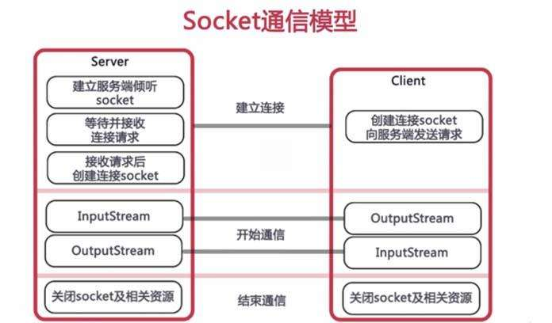

## Socket.io
### Socket.io是什么
    - 基于事件的的实时双向通信库
      - 基于websocket协议
      - 前后端通过事件进行双向通信
### Socket.io和Ajax的区别
    - Ajax基于http协议, 单向, 实时获取数据只能轮询
    - socket.io基于websocket双向通信协议, 后端可以主动推送数据
### Socket通信模型
